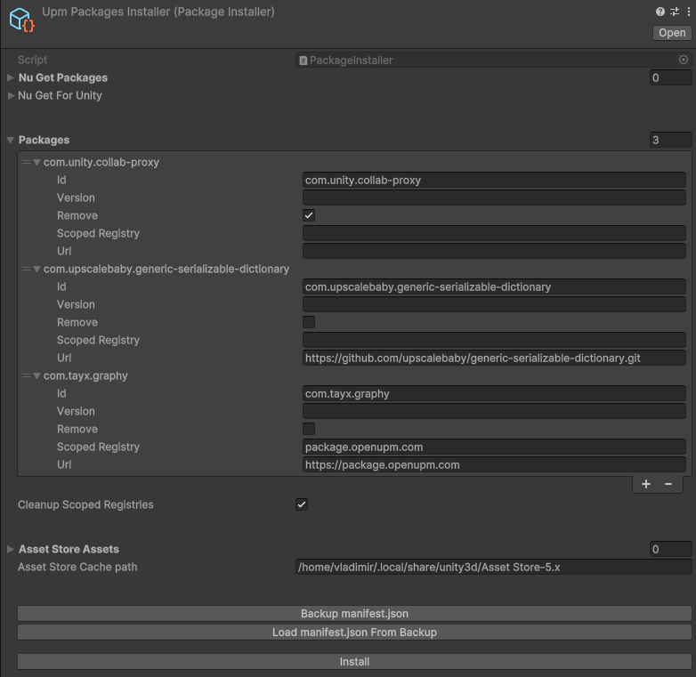
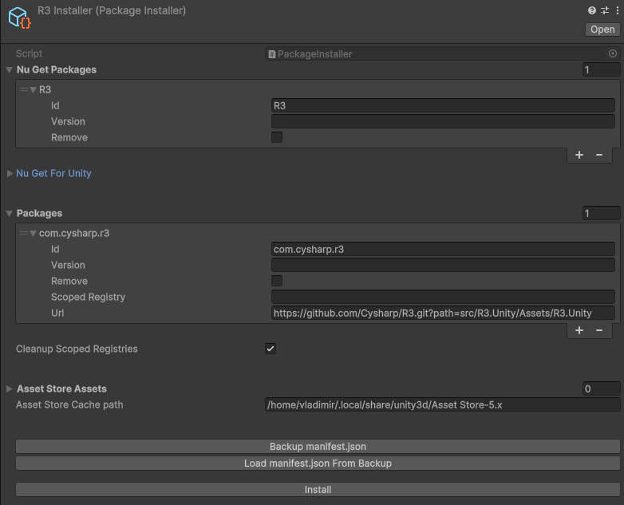
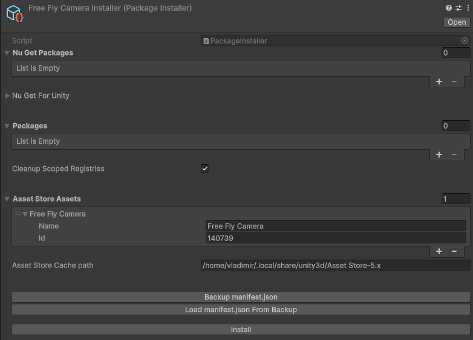

# Bulk Package Installer for Unity

Install and remove NuGet packages, UPM packages and Asset Store assets with single click of a button.

## Installation

- Via Unity Package Manager:
   Press the plus sign and choose `Add package from git URL...`. There, use `https://github.com/vklubkov/UnityBulkPackageInstaller.git`, or, with version: `https://github.com/vklubkov/UnityBulkPackageInstaller.git#1.1.0`
- You can also clone this repository and then add it as a local package using `Add package from disk...` option.
- Another way is to manually edit the `manifest.json` file in your `Packages` folder. Add `"com.vklubkov.bulkpackageinstaller" : "https://github.com/vklubkov/UnityBulkPackageInstaller.git"`, or, with version: `"com.vklubkov.bulkpackageinstaller" : "https://github.com/vklubkov/UnityBulkPackageInstaller.git#1.1.0"`
- Alternatively, you can download the package into your `Assets` folder

## Getting started

1. Use the `Assets` menu or the right-click menu in the `Project` window and select `Create->Bulk Package Installer->New Installer`
2. Name the installer file
3. Set up the packages you want to install or remove
4. *Optional:* press the `Backup manifest.json` button to save your UPM packages manifest before the install.
5. Press the `Install` button

## Examples

### UPM packages

An installer that handles multiple UPM packages:

- removes the [Unity Version Control](https://docs.unity3d.com/6000.0/Documentation/Manual/com.unity.collab-proxy.html) package `com.unity.collab-proxy`, as it is not needed when you use Git
- installs a useful [Generic Serializable Dictionary](https://github.com/upscalebaby/generic-serializable-dictionary) with id `com.upscalebaby.generic-serializable-dictionary` from git Url `https://github.com/upscalebaby/generic-serializable-dictionary.git`
- installs [Graphy](https://github.com/Tayx94/graphy), a popular FPS counter, from `package.openupm.com` scoped registry with URL `https://package.openupm.com` and scope `com.openupm com.tayx.graphy`



### NuGet packages

An installer for the [R3](https://github.com/Cysharp/R3) reactive extensions, which consists of an UPM package `com.cysharp.R3` installed from a Git url `https://github.com/Cysharp/R3.git?path=src/R3.Unity/Assets/R3.Unity`, and a NuGet package `R3`:



### Asset Store assets

An installer for the [Free Fly Camera](https://assetstore.unity.com/packages/tools/camera/free-fly-camera-140739) asset.

- the package id `140739` is taken from its URL: `https://assetstore.unity.com/packages/tools/camera/free-fly-camera-140739`, 

- the name of the package can be any, but I recommend to simply copy it from the Asset Store for convenience.




## License

### [MIT](LICENSE.md)

```
MIT License

Copyright (c) 2024-2025 Vladimir Klubkov

Permission is hereby granted, free of charge, to any person obtaining a copy
of this software and associated documentation files (the "Software"), to deal
in the Software without restriction, including without limitation the rights
to use, copy, modify, merge, publish, distribute, sublicense, and/or sell
copies of the Software, and to permit persons to whom the Software is
furnished to do so, subject to the following conditions:

The above copyright notice and this permission notice shall be included in all
copies or substantial portions of the Software.

THE SOFTWARE IS PROVIDED "AS IS", WITHOUT WARRANTY OF ANY KIND, EXPRESS OR
IMPLIED, INCLUDING BUT NOT LIMITED TO THE WARRANTIES OF MERCHANTABILITY,
FITNESS FOR A PARTICULAR PURPOSE AND NONINFRINGEMENT. IN NO EVENT SHALL THE
AUTHORS OR COPYRIGHT HOLDERS BE LIABLE FOR ANY CLAIM, DAMAGES OR OTHER
LIABILITY, WHETHER IN AN ACTION OF CONTRACT, TORT OR OTHERWISE, ARISING FROM,
OUT OF OR IN CONNECTION WITH THE SOFTWARE OR THE USE OR OTHER DEALINGS IN THE
SOFTWARE.
```

### [Third Party Notices](Third%20Party%20Notices.md)

Some code (`AssetDownloader.cs`, possibly `Survivor.cs`) is based on the code of the
[Unity Asset Retriever](https://github.com/Renge-Games/UnityAssetRetriever) by
[Renge-Games](https://github.com/Renge-Games) (Sam Schiffer), distributed under MIT license:

```
MIT License

Copyright (c) 2023 Renge

Permission is hereby granted, free of charge, to any person obtaining a copy
of this software and associated documentation files (the "Software"), to deal
in the Software without restriction, including without limitation the rights
to use, copy, modify, merge, publish, distribute, sublicense, and/or sell
copies of the Software, and to permit persons to whom the Software is
furnished to do so, subject to the following conditions:

The above copyright notice and this permission notice shall be included in all
copies or substantial portions of the Software.

THE SOFTWARE IS PROVIDED "AS IS", WITHOUT WARRANTY OF ANY KIND, EXPRESS OR
IMPLIED, INCLUDING BUT NOT LIMITED TO THE WARRANTIES OF MERCHANTABILITY,
FITNESS FOR A PARTICULAR PURPOSE AND NONINFRINGEMENT. IN NO EVENT SHALL THE
AUTHORS OR COPYRIGHT HOLDERS BE LIABLE FOR ANY CLAIM, DAMAGES OR OTHER
LIABILITY, WHETHER IN AN ACTION OF CONTRACT, TORT OR OTHERWISE, ARISING FROM,
OUT OF OR IN CONNECTION WITH THE SOFTWARE OR THE USE OR OTHER DEALINGS IN THE
SOFTWARE.
```
